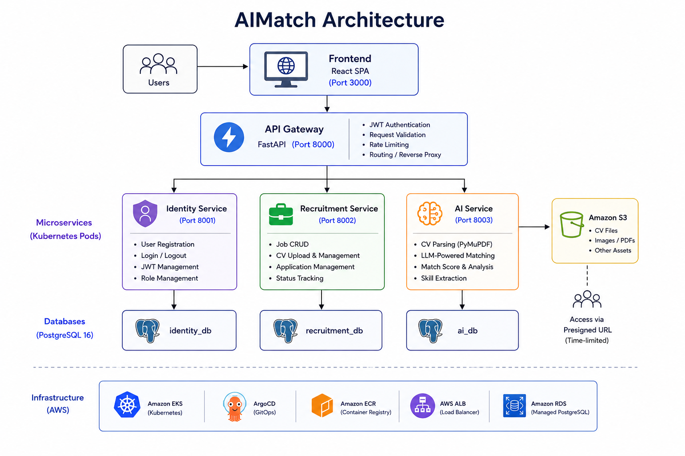
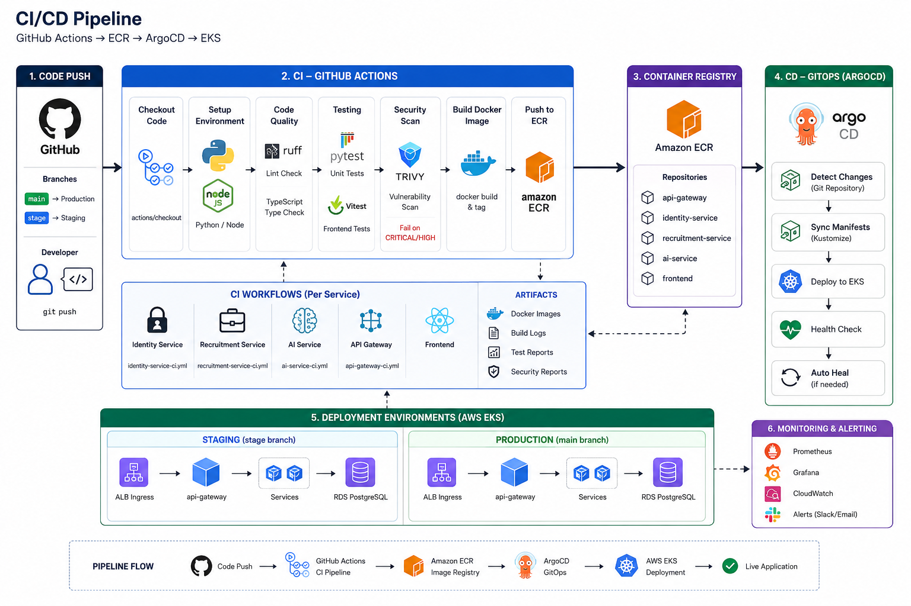

# AIMatch - AI-Powered Recruitment Platform

[](https://www.python.org/)
[](https://fastapi.tiangolo.com/)
[](https://react.dev/)
[](https://www.typescriptlang.org/)
[](https://www.docker.com/)
[](https://argo-cd.readthedocs.io/)
[](https://www.terraform.io/)
[](https://aws.amazon.com/)
[](https://github.com/features/actions)

A modern full-stack recruitment platform that leverages AI to intelligently match candidates with job opportunities. Built with a microservices architecture, deployed on AWS EKS via GitOps (ArgoCD), and fully containerized with Docker.

---

## Table of Contents

- [Architecture](#architecture)
- [Features](#features)
- [Tech Stack](#tech-stack)
- [Project Structure](#project-structure)
- [Getting Started](#getting-started)
- [CI/CD Pipeline](#cicd-pipeline)
- [Infrastructure](#infrastructure)
- [API Documentation](#api-documentation)

---

## Architecture



### Microservices

| Service | Port | Responsibility |
|---------|------|----------------|
| **API Gateway** | 8000 | Authentication, request routing, reverse proxy |
| **Identity Service** | 8001 | User registration, login, JWT management |
| **Recruitment Service** | 8002 | Job CRUD, CV upload, application management |
| **AI Service** | 8003 | CV-Job matching powered by self-hosted Qwen3-4B via vLLM |
| **Frontend** | 3000 | React SPA (served via Nginx) |

---

## Features

### For Candidates
- **User Registration & Authentication** — Secure JWT-based auth with role-based access
- **CV Management** — Upload and manage CVs (PDF support via PyMuPDF)
- **Job Browsing** — Search and filter jobs by location, type, and status
- **AI-Powered Matching** — Submit CV against a job description to get an intelligent match score and analysis
- **Application Tracking** — Monitor application status in real-time

### For Recruiters
- **Job Posting** — Create, update, and manage job listings
- **Application Review** — View and manage candidate applications
- **Status Management** — Update application statuses (pending, reviewed, accepted, rejected)

### Platform
- **Microservices Architecture** — Independently deployable services with clear domain boundaries
- **GitOps Deployment** — ArgoCD syncs Kubernetes manifests from Git
- **Infrastructure as Code** — AWS resources provisioned via Terraform modules
- **Automated CI/CD** — GitHub Actions with quality gates (lint, test, vulnerability scan)
- **Container Security** — Trivy scanning for CRITICAL/HIGH vulnerabilities in CI
- **Branch-Based Environments** — `main` → production, `stage` → staging

---

## Tech Stack

### Backend
- **FastAPI** — High-performance async Python web framework
- **SQLAlchemy 2.0** — ORM with async support
- **PostgreSQL 16** — Primary database (per-service databases)
- **JWT (python-jose)** — Token-based authentication
- **bcrypt** — Password hashing
- **PyMuPDF** — PDF text extraction for CV parsing
- **Cloudinary** — CV file storage
- **LLM Providers**:
  - Self-hosted Qwen3-4B via vLLM
  - OpenRouter-compatible cloud models

### Frontend
- **React 19** — UI library
- **TypeScript** — Type-safe development
- **Vite 6** — Build tool
- **React Router 7** — Client-side routing
- **TailwindCSS 4** — Utility-first styling
- **Motion (Framer Motion)** — Animations
- **Axios** — HTTP client
- **pdfjs-dist** — PDF preview in browser
- **Lucide React** — Icon library
- **Cloudflare Workers** — Frontend deployment target (Wrangler)

### DevOps & Infrastructure
- **Docker & Docker Compose** — Containerization and local orchestration
- **Kubernetes + Kustomize** — Manifest management with environment overlays
- **ArgoCD** — GitOps continuous delivery
- **Terraform** — AWS infrastructure provisioning
- **GitHub Actions** — CI/CD pipelines
- **Trivy** — Container vulnerability scanning
- **Pre-commit** — Code quality hooks (ruff, yaml/toml/json checks)
- **AWS EKS** — Managed Kubernetes cluster
- **AWS ECR** — Container image registry
- **AWS RDS** — Managed PostgreSQL
- **AWS ALB** — Application Load Balancer
- **AWS S3** — Object storage
- **AWS Secrets Manager** — Secret storage
- **External Secrets Operator** — Kubernetes-to-Secrets-Manager bridge
- **IRSA (IAM Roles for Service Accounts)** — Fine-grained AWS permissions

---

## Project Structure

```
Course_Project/
├── .github/
│   └── workflows/
│       ├── template-backend.yaml       # Reusable backend CI template
│       ├── template-frontend.yaml      # Reusable frontend CI template
│       ├── identity-service-ci.yml     # Identity service pipeline
│       ├── recruitment-service-ci.yml  # Recruitment service pipeline
│       ├── ai-service-ci.yml           # AI service pipeline
│       ├── api-gateway-ci.yml          # API Gateway pipeline
│       └── frontend-ci.yml             # Frontend pipeline
├── backend/
│   ├── services/
│   │   ├── identity-service/           # Auth & user management
│   │   │   ├── app/
│   │   │   │   ├── main.py             # FastAPI app entry
│   │   │   │   ├── router.py           # Auth endpoints
│   │   │   │   ├── models.py           # SQLAlchemy models
│   │   │   │   ├── schemas.py          # Pydantic schemas
│   │   │   │   ├── security.py         # JWT utilities
│   │   │   │   ├── service.py          # Business logic
│   │   │   │   └── deps.py             # Dependency injection
│   │   │   ├── tests/
│   │   │   ├── Dockerfile
│   │   │   ├── Makefile
│   │   │   └── pyproject.toml
│   │   ├── recruitment-service/        # Job & application management
│   │   │   ├── app/
│   │   │   │   ├── main.py
│   │   │   │   ├── router.py
│   │   │   │   ├── models.py
│   │   │   │   ├── schemas.py
│   │   │   │   └── deps.py
│   │   │   ├── tests/
│   │   │   ├── Dockerfile
│   │   │   ├── Makefile
│   │   │   └── pyproject.toml
│   │   ├── ai-service/                 # CV-Job AI matching
│   │   │   ├── app/
│   │   │   │   ├── main.py
│   │   │   │   ├── router.py
│   │   │   │   ├── models.py
│   │   │   │   ├── schemas.py
│   │   │   │   └── deps.py
│   │   │   ├── tests/
│   │   │   ├── Dockerfile
│   │   │   ├── Makefile
│   │   │   └── pyproject.toml
│   │   └── api-gateway/                # Reverse proxy & auth
│   │       ├── app/
│   │       │   ├── main.py
│   │       │   ├── security.py
│   │       │   └── schemas.py
│   │       ├── tests/
│   │       ├── Dockerfile
│   │       ├── Makefile
│   │       └── pyproject.toml
│   └── README.md
├── frontend/
│   ├── src/
│   │   ├── app/
│   │   │   ├── router.tsx              # React Router config
│   │   │   └── ProtectedRoute.tsx      # Auth guard
│   │   ├── pages/
│   │   │   ├── auth/                   # Login, Register
│   │   │   ├── candidate/              # Home, CV, Jobs, Applications
│   │   │   └── recruiter/              # Jobs, Create Job, Job Detail
│   │   ├── services/                   # API client modules
│   │   ├── types/                      # TypeScript interfaces
│   │   └── utils/                      # Helpers (PDF extraction)
│   ├── Dockerfile
│   ├── package.json
│   └── vite.config.ts
├── infra/
│   ├── k8s-spec/
│   │   ├── argocd/                     # ArgoCD Application manifests
│   │   │   ├── aimatch-prod-application.yaml
│   │   │   └── aimatch-stage-application.yaml
│   │   └── manifests/
│   │       ├── base/                   # Base Kustomization
│   │       └── overlays/
│   │           ├── prod/               # Production image versions
│   │           └── stage/              # Staging image versions
│   └── terraform/
│       ├── envs/dev/                   # Dev environment config
│       └── modules/                    # Reusable Terraform modules
│           ├── vpc/                    # VPC & networking
│           ├── eks/                    # EKS cluster
│           ├── ecr/                    # ECR repositories
│           ├── rds/                    # RDS PostgreSQL
│           ├── s3/                     # S3 buckets
│           ├── secrets/                # Secrets Manager
│           ├── irsa/                   # IAM Roles for Service Accounts
│           ├── alb/                    # Application Load Balancer
│           ├── argocd/                 # ArgoCD installation
│           └── eso/                    # External Secrets Operator
├── nginx/
│   ├── Dockerfile
│   └── nginx.conf
├── docker-compose.yml                 # Local development orchestration
├── .pre-commit-config.yaml            # Pre-commit hooks config
└── README.md
```

---

## Getting Started

### Prerequisites

- **Docker** & **Docker Compose** — for local development
- **Python 3.12+** — for backend development
- **Node.js 18+** — for frontend development
- **uv** — Python package manager
- **Make** — for running service commands

### Local Development

1. **Clone the repository**
   ```bash
   git clone https://github.com/NT548-Q21-Project/Course_Project.git
   cd Course_Project
   ```

2. **Configure environment variables**
   ```bash
   # Copy example env files for each service
   cp backend/services/identity-service/.env.example backend/services/identity-service/.env
   cp backend/services/recruitment-service/.env.example backend/services/recruitment-service/.env
   cp backend/services/ai-service/.env.example backend/services/ai-service/.env
   cp backend/services/api-gateway/.env.example backend/services/api-gateway/.env
   ```

3. **Start all services**
   - Default (OpenRouter)
   ```bash
   docker compose up --build
   ```

   - Self-hosted Qwen3-4B
   ```bash
   docker compose --profile gpu up --build
   ```

   This starts:
   - PostgreSQL on `localhost:5432`
   - Identity Service on `localhost:8001`
   - Recruitment Service on `localhost:8002`
   - AI Service on `localhost:8003`
   - API Gateway on `localhost:8000`
   - Nginx on `localhost:80`

4. **Access the application**
   - Web UI: [http://localhost](http://localhost)
   - API Gateway: [http://localhost:8000](http://localhost:8000)
   - API Docs: [http://localhost:8000/docs](http://localhost:8000/docs)

### Backend Development

Each service uses `uv` for dependency management and `Makefile` for common tasks:

```bash
cd backend/services/<service-name>

make ci-install   # Install dependencies
make check        # Run linting (ruff)
make test         # Run pytest
```

### Frontend Development

```bash
cd frontend

npm install
npm run dev       # Start dev server on port 3000
npm run build     # Production build
npm run lint      # TypeScript type check
```

---

## CI/CD Pipeline



### Branch Strategy

| Branch | Environment | ArgoCD App |
|--------|-------------|------------|
| `main` | Production | `aimatch-prod` |
| `stage` | Staging | `aimatch-stage` |

---

## Infrastructure

The platform runs on AWS, provisioned entirely with Terraform:

| Component | AWS Service | Purpose |
|-----------|-------------|---------|
| Networking | VPC | Isolated network with public/private subnets |
| Compute | EKS | Managed Kubernetes cluster |
| Container Registry | ECR | Stores Docker images for all services |
| Database | RDS (PostgreSQL 16) | Managed database per service |
| Storage | S3 | CV file uploads |
| Load Balancer | ALB | Ingress for cluster services |
| Secrets | Secrets Manager | JWT keys, DB credentials, API keys |
| GitOps | ArgoCD | Automated deployment from Git |
| Auth | IRSA + ESO | Pod-level AWS access, secret injection |

### Terraform Modules

All infrastructure is organized into reusable modules under `infra/terraform/modules/`:

- `vpc` — VPC, subnets, NAT gateways, route tables
- `eks` — EKS cluster, node groups, IRSA OIDC
- `ecr` — ECR repositories with lifecycle policies
- `rds` — RDS PostgreSQL with automated backups
- `s3` — S3 buckets for file uploads
- `secrets` — Secrets Manager secrets (JWT, DB URLs, LLM keys)
- `irsa` — IAM Roles for Service Accounts per microservice
- `alb` — AWS Load Balancer Controller, ingress class
- `argocd` — ArgoCD installation with ingress
- `eso` — External Secrets Operator for K8s secret sync

---

## API Documentation

Once running, interactive API documentation is available at:

- **Swagger UI**: `http://localhost:8000/docs`
- **ReDoc**: `http://localhost:8000/redoc`

### Key Endpoints

```
# Identity Service
POST   /api/auth/register          Register a new user
POST   /api/auth/login             Login (returns JWT)
GET    /api/auth/me                Get current user info
POST   /api/auth/logout            Logout (client-side token removal)

# Recruitment Service
GET    /api/recruitment/jobs       List public jobs (with filters)
GET    /api/recruitment/jobs/my    List my posted jobs (recruiter)
GET    /api/recruitment/jobs/{id}  Get job detail
POST   /api/recruitment/jobs       Create job (recruiter)
PATCH  /api/recruitment/jobs/{id}  Update job (recruiter)
GET    /api/recruitment/cvs        List my CVs (candidate)
POST   /api/recruitment/cvs/upload Upload a CV (candidate)
DELETE /api/recruitment/cvs/{id}   Delete CV (candidate)
POST   /api/recruitment/applications       Apply to a job (candidate)
GET    /api/recruitment/applications/me    My applications (candidate)
GET    /api/recruitment/applications/job/{id}  Job applicants (recruiter)
PATCH  /api/recruitment/applications/{id}/status  Update status (recruiter)

# AI Service
POST   /api/ai/match               Analyze CV vs Job (candidate)
GET    /api/ai/match-results       My match history (candidate)
GET    /api/ai/match-results/{id}  Match result detail
```

---

## License

MIT

---

## Contact

Project Repository: [https://github.com/NT548-Q21-Project/AI-Match](https://github.com/NT548-Q21-Project/AI-Match)
